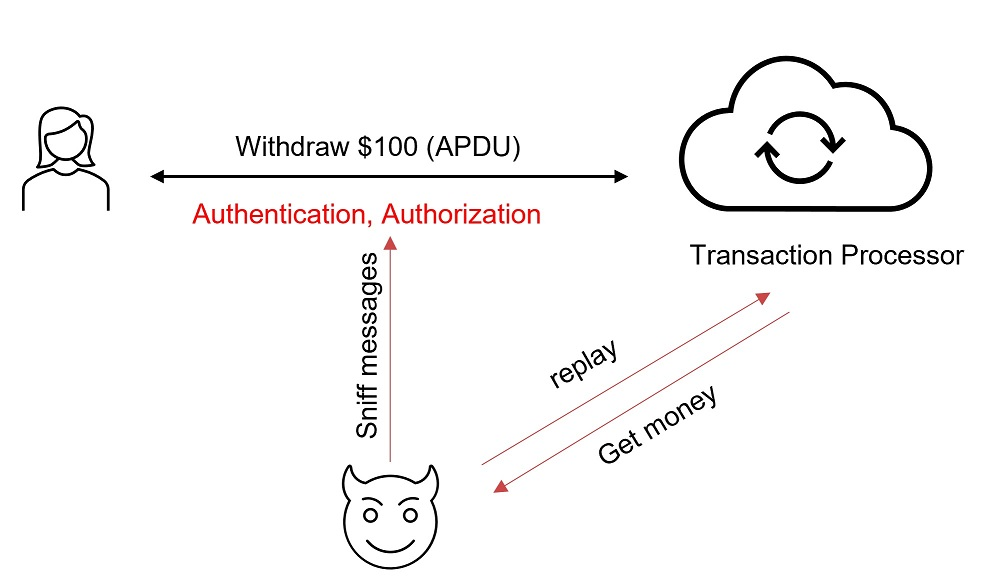
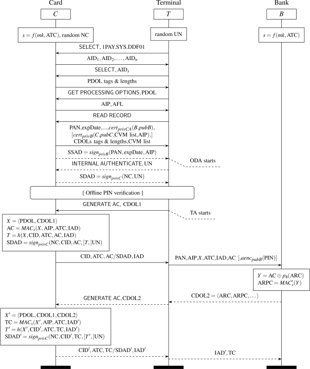

In this article, I am reviewing the security of EMV transactions against replay attacks. After briefly recalling the EMV framework and its countermeasures against replay attacks, a number of reported attacks will be analyzed. For each succesfull attack, I am going to go through the following questions:
1. What was happened?
2. How was that happened?
3. Why was that happened?
4. Key takeaways from the attack?

What is Replay Attack?
======

As defined by [wikipedia](https://en.wikipedia.org/wiki/Replay_attack), a replay attack is a form of network attack in which valid data transmission is maliciously or fraudulently repeated or delayed. A simple replay attack that captures user password and reuse to login into the system can be illustrated as in the below picture:

Fig. 1: Replay Attack

In this scenario, assuming that Bob is a service provider, Alice is using her credential to login to Bob's service. After a couple of messages exchanged, Alice authenticates to Bob's service and Bob will grant/authorize an access to Alice in returns. Without proper prevention measures, Eve might be able to intercept those messages and then pretending as Alice, she tries to replay them to gain an unauthorized access to Bob's service. 

The impact of replay attacks could be from medium to very high to the system. If replaying allows the hacker to gain a single unauthorized access to a service system (and limited to the service provided), then the impact is just medium. However, if a replay attack allows the hacker to have an access to the system (temporary or permanent), and from that he is able to control or escalate to higher level of access by exploiting the system's vulnerabilities, then the impact is highly severe. 

Typically, replay attacks could be prevented by making a message/transaction unrepeateable. That could be done by assigning an unique random number to the message/transaction or a networking session. A service provider can check if the granted token was used or not before granting an access to the system. A network message/packet from previous session (distinguished from unique session ID) won't be accepted by the server, etc. 

Fig. 2: Message Authentication Code

The replay attack could be also prevented by using a Message Authentication Code (MAC) or a challenge-response authentication. More details of the countermeasures could be found in [Prevention and countermeasures, replay attack](https://en.wikipedia.org/wiki/Replay_attack).

What is a Replay Attack on Payment schemes?
======

Similarly to a replay attack in network security, in this context, a fraudster will try to replay a payment message (e.g., APDU or Application Protocol Data Unit in smart card transactions) captured from a victim payment card to withdraw money into his wallet/account. It can be illustrated as in the below picture:

<!---

--->

Fig. 3: Replay attacks against Payment Systems

Different from a replay attack in network security, 'transaction processor' in payment schemes is not a single server or program, it may consist of some entities, including merchant's POS terminal, acquiring bank, card network, issuing bank. The authentication and authorization processes involving more than one party are more complicated, and hence present more higher risks to replay attacks. 

This could be carried out in the following potential attack paths:

1. Hacker collects payment transactions from one payment network, and then replay reformatted transactions to another payment network;
2. Hacker collects payment authentication tokens (CVC3) from a victim card, that have not been settled yet, then replay them on another point-ofsale (POS) terminal.  
3. Hacker asks victim card for payment requests (ARQC or Application Request Cryptogram) at one POS terminal, then redeems those ARQCs at another POS terminal (or ATM).

How EMV protocol is designed to prevent replay attacks?
======

Let's review the EMV transaction flow to see how it was designed to prevent replay attacks. The full EMV transaction flow is depicted as in the below diagram:

<!--

-->

Fig. 4: EMV Transaction Flow (Source: EMV Book 3 - Application Specification [1])

Briefly, a EMV payment consists of the following steps:

1. Application Selection
2. Card Data Authentication
3. Cardholder Verification
4. Terminal Action Analysis
5. Card Action Analysis
6. Application Cryptogram Generation
7. Script Processing
8. Completion

The full EMV transaction flow is complex, and explaining it in details was not an intention of this article. Let check what are countermeasures proposed in the EMV protocol to prevent a replay attack.

As shown in **Fig. 4**, in order to be authorized a (online) transaction, payment card must generate an *Application Request Cryptogram* (ARQC) that sent to the issuing bank to verify. An ARQC cryptogram contains an *Application Transaction Counter* (ATC) (that is securely protected and computed in payment smartcards), a MAC signature that signs on a dynamic data, including an *Unpredictable Number* (UN) generated by the POS Terminal. The MAC signature can be only generated by the card holding a Master secret key (MK) in a secure memory, and only verified by the issuer for its integrity and confidentiality. Furthermore, the issuer can verify the ATC for its *uniqueness* and *validity* (i.e., monotonically increasing). If any checks above fail, the transaction won't be authorized by the issuing bank. 

Fig. 5: Generation of Application Cryptogram

In order to support an older version of POS Terminals that only accept Magnetic Stripe payment cards, EMV cards enable a compatible mode, so-called MagStripe. In this mode, a dynamic card verification code (CVC3) will be generated instead of MAC signature for authorizing the transactions. This value is generated by applying a cryptographic checksum on the card’s ATC and UN (generated by terminal) with a dedicated symmetric key securely stored in the payment card. This CVC3 value and ATC will be sent to the issuing bank for verifying. Note that the authentication code CVC3 authenticates only the card and not the contents of a payment transaction. 

Fig. 6: Generation of CVC3 values

The main differences between EMV mode and MagStripe mode include: (1) no offline authentication of static card data; and (2) no authentication of payment transaction data (due to no contents of transactions).

**In both modes:** 
* The application transaction counter (ATC) aims at preventing re-use of previously used authentication codes (re-play). 
* The unpredictable number (UN) aims at preventing pre-generation of authentication codes on a real card for later use in fraudulent transactions (pre-play).

It seems that EMV protocol was very well-designed against replay attacks. So, `why EMV payment cards are still vulnerable to replay attack?`

**Let talk a closer look at the EMV countermeasures.**

* EMV framework uses a unique number, ATC synchronized between card and issuing bank. This is a monotonic increasing sequence of numbers, used once per transaction, `but issuing bank can accept previous ATC.`

* Using unpredictable number (UN), generated by POS terminal
  * T → C:    n	where n is a freshly chosen random number, aka, a nonce
  * C → T:    (m, n, MACk(m,n))

But wait, who can verify the validity of this `nonce`. This nonce  was generated by a POS terminal. It can be poorly generated or even worse terminal can be `compromised` or even `collusive`. At the end of the day, backend parties, i.e., card network and card issuer are the ones who authorize a payment transaction. And these flaws lead to the following reported attacks.

Attacks against weak RNG generation on ATM and POS terminals
======

## Security Flaws
The first pre-play attack demonstrated again Chip-and-Pin cards was presented by Bond et al [3] from University of Cambridge. In 2012, they discovered that the random number  (i.e., unpredictable number) generation is weak in several ATM and POS terminal implementations. An attacker could abuse this to predict the unpredictable number (UN) sequence of a terminal or to even trigger the terminal to use a specific UN. In more particular, the attack can be carried out due to the following security flaws:

* **EMV protocol flaws**
  * 1st flaw: EMV does not require the identity of the terminal. For example, the standard format developed by Visa (the version 10 cryptogram format) requires only the terminal country code.
  * 2nd flaw: the issuing bank relies on the terminal for transaction freshness (i.e., UNs generated by the terminal). However, the terminal can be compromised or even collusive. 
* **Weak PNG**: some ATM and POS terminal just use a counter for RNG, that is completely predictable. Even the suggested construction (hash or XOR of previous ARQCs, transaction counter and time) would not be adequate if the ATM or POS is rebooted and thus those values are predictable. 

## Attack Flow

The attack flow is as follows:
1. `Step 1`: Collecting UN data and high-resolution timestamps 
  * At ATMs: using a legitimate debit card added a microcontroller (i.e., analyzing ATM protocol) and a memory to store transaction logs. Collect 5 - 50 unpredictable numbers from each ATM investigated by performing repeated balance enquiries and a small cash withdrawal. 
  * At POS terminals: using the smartcard detective that relies on a hidden wire running up the experimenter's sleeve. 
  * Identify weakness in RNG, for example: counters or clocks directly used as the UN; simple RNG with little or no seeding, etc. 
2. `Step 2`: Harvesting data from a victim for use later: a tampered terminal in a store collect static card details and call GENERATE AC to obtain an ARQC and TC for each possible UN 
  * For each card, several dozen ARQCs can be harvested in a reasonable time. 
3. `Step 3`: Cashing out:  replay transaction from the harvested list

Fig. 7: Pre-play attack using a weak RNG (left) or tampering with the UN at the ATM/POS side (right) (Source: Be Prepared: The EMV Pre-play Attack [2])

## Lessons Learned
1. RNG generators must be securely and properly implemented on ATM and POS terminals.
2. Securing the ATM networking
3. Securing POS terminal from being manipulated or infected by a malware (even with a perfectly secure RNG, a malware can sabotage the UNs generated)
4. Issuing bank checks ATC for preventing duplicated transactions 
5. Issuing bank checks TC before settlement 

Attacks against MasterCard Magstripe Mode
======

In their paper in 2013, Roland and Langer from NFC Research Lab Hagenberg, University of Applied Sciences Upper Austria demonstrated a pre-play attack to perform a limited number of EMV MagStripe transactions at any EMV contactless payment terminal. Two attack scenarios were presented:
- In the first attack scenario, a pre-play attack, the attacker pre-calculates a number of dynamic card verification codes (CVC3) for the Mag-Stripe protocol from a genuine contactless Mag-Stripe card. These pre-played codes are then stored on the functional card clone and used when an authorization code is requested by the POS terminal.
- In the second attack scenario, a downgrade attack, the pre-play attack is extended to modern credit/debit cards that support both, EMV mode and MagStripe mode by selectively hiding the EMV mode capabilities from the POS terminal.

## First scenario: Pre-play attack
The Unpredictable Number in COMPUTE CRYPTOGRAPHIC CHECKSUM is a 4-byte value (i.e., UN could be ranged from 0 to 232 - 1), however its use is weakened by the protocol design:
- EMV encodes UNs in BCD representation, thus reduces the range from 0 to 108 - 1, about 43 times less than the full range
- The MagStripe protocol further reduces the size of the UNs to nUN digits: nUN = kTRACK1 - tTRACK1 = kTRACK2 - tTRACK2, where kTRACK1 is the number of bits set in the “Track 1 bit map for UN and ATC” (BMAPATC, UN, TRACK1) and tTRACK1 is the “Track 1 number of ATC digits” and the same for kTRACK2 and tTRACK2. Both values are stored in the card’s Mag-Stripe data file. Typical values found in the attack is nUN = 1--3, that is the maximum range of UNs is from 0 to 999. 

Thus, an attacker can calculate a full set of authentication codes CVC3 (covering the whole range (0 to 999) of UN field) of a genuine MagStripe card in only about a minute. Then, he can reuse these CVC3 to authorize transactions later. 

## Second  scenario: Downgrade attack 
Attacker tricks the POS terminal to use MagStripe mode, even the original card supports EMV mode by simply changing the AIP on card clone (application interchange profile) in returning to GPO (GET_PROCESSING_OPTIONS) command. 

### Attack Flow
The attack flow is as follows:
1. Collect data for pre-play and downgrade attacks  
  * use app on NFC-enabled mobile phone 
  * read static card data 
  * modify EMV mode flag (change from EMV mode to Magstripe mode by modifying AIP value to 0x0080) 
  * pre-generate 1000 CVC3s 
    * one code for each possible UN
    * at least one transaction can be performed 
2. Create clone card 
  * use applet on JavaCard
  * applet contains data structures of credit card 
    * will be filled with static data from original card 
  * applet contains list of UN + ATC + CVC3 sets 
    * will be filled with pre-played CVC3s
    * clone returns first set that matches a given UN
3. Pay with clone card at POS terminals

### Lessons Learned
1. Mastercard Magstripe design is insecure. Because of the security flaw in designing COMPUTE CRYPTOGRAPHIC CHECKSUM, the possible range of unpredictable numbers is greatly reduced that makes a full set of CVC3s can be pre-calculated in a minutes. 
2. Cards' issuers need to issue cards with longer UN lengths (at least 4), and must properly check ATC
3. Cards' issuers should prompt for a second factor of authentication on failed transaction, such as PIN, Insert Chip Card
4. Non M/Chip contactless transactions and out-of-order ATC transactions should be rejected. 

2014 Attacks from Brazil 
======
In 2014, a credit card fraud campaign emanating from Brazil and targeting U.S. financial institutions [2]. At least three U.S. financial institutions reported receiving tens of thousands of dollars in fraudulent credit and debit card transactions coming from Brazil. They were all submitted through Visa and Mastercard networks as chip-enabled transactions and all those unauthorized transactions are under the card-issuing banks even it seems card information is leaked from Home Depot's data breach. Why is that happened?   

> the credit card company said the most likely explanation was that fraudsters were pushing regular magnetic stripe transactions through the card network as EMV purchases using a technique known as a “replay” attack. ([KrebsonSecurity](https://krebsonsecurity.com/2014/10/replay-attacks-spoof-chip-card-charges/))

> According to the bank, MasterCard officials explained that the thieves were probably in control of a payment terminal and had the ability to manipulate data fields for transactions put through that terminal. After capturing traffic from a real EMV-based chip card transaction, the thieves could insert stolen card data into the transaction stream, while modifying the merchant and acquirer bank account on the fly. ([KrebsonSecurity](https://krebsonsecurity.com/2014/10/replay-attacks-spoof-chip-card-charges/))

## What is the attack flow?

- First, thieves collected regular magnetic stripe transactions, 
- Then collecting EMV-based chip card transactions, 
- And then modified magnetic stripe transactions' data with real EMV-based chip card transactions' data making magnetic stripe transactions as chip card purchases, 
- Finally pushed them into the card networks as EMV transactions. 

> “The [Canadian] bank in this case would take any old cryptogram and they weren’t checking that one-time code because they didn’t have it implemented correctly,” Litan said. “If they saw an EMV transaction and didn’t see the code, they would just authorize the transaction.” 

> Litan said the fraudsters likely knew that the Canadian bank wasn’t checking the cryptogram and that it wasn’t looking for the dynamic counter code. 

> “The bad guys knew that if they encoded these as EMV transactions, the banks would loosen other fraud detection controls,” Litan said. “It appears with these attacks that the crooks aren’t breaking the EMV protocol, but taking advantage of bad implementations of it. Doing EMV correctly is hard, and there are lots of ways to break not the cryptography but to mess with the implementation of EMV.” ([KrebsonSecurity](https://krebsonsecurity.com/2014/10/replay-attacks-spoof-chip-card-charges/))

> It appears that the Evolution software is designed to target banks that are in the process of architecting their payment networks to handle EMV transactions, but that nevertheless aren’t yet properly checking the EMV cryptogram and/or counter for these transactions. It also seems that some banks have inexplicably lowered their fraud controls on EMV transactions, even though they are not yet taking advantage of the added security protections offered by chip-based cards.

> “The reason I think they bother to fake EMV transactions is that they know the EMV card issuing banks relax their fraud controls on them and don’t have it implemented properly and therefore they do not properly check the dynamic EMV data,” said Avivah Litan, a fraud analyst with Gartner Inc. ([KrebsonSecurity](https://krebsonsecurity.com/2014/10/replay-attacks-spoof-chip-card-charges/))

## What are reasons behind the attack?
- Due to most payment operators do not perform all validations as required by EMV standard. 
- The bank were not checking the cryptogram and the ATC before authorizing a EMV transaction (bad implementation)  
- There are security flaws when moving from regular magnetic cards to chip-and-PIN cards

## Lesson Learned
1. Financial institutions must fully and properly implement EMV protocols for accepting and validating chip-card transactions.
2. There must be well-defined procedures and proper path when upgrading a system (i.e., from regular magnetic cards ton chip-based cards)

Google Pay Replay Attack 
======
The attack was publicly reported in July 2018 against Google Pay via the NFC technology (more information in [4]). 

## Attack Flow
1. Intercept NFC transactions, containing payment tokens
2. The intercepted tokens will be manipulated in different location and with different hardware (e.g., different POS terminal) 
3. Copy tokens into a functional 'fake' payment device
4. Redeem tokens at a NFC-enabled terminal 

A video demo could be found in this link. 
[http://youtube.com/watch?v=pomyDepFie0](http://youtube.com/watch?v=pomyDepFie0)

## Why this can be happened?
The attack can be successfully carried out due to the following reasons: 

* Google Pay did not implement security layers that avoid or prevent replay or downgrade attacks such as: 
  - Anti-replay protocol, a subprotocol in IPSec
  - Secure connection by encryption with TLS

* Lack of mechanisms to protect the integrity of the Google pay tokens 
  - If having, attacker can not modify the payment mode (i.e., downgrading to magstripe mode)
  - If having, attacker can not modify the location, hardware (POS terminal) info

Attackers thus could intercept transaction tokens, manipulate them such as change payment mode to magstripe transaction (e.g., Visa MSD) by just changing the AIP values from 20 40 to 00 80 (as shown in the picture below).
 

Fig. 8: Downgrade attack from RFU/OTA capable mobile device (0x2040) to magstripe mode (0x0080) by changing AIP bytes

This manipulation could be done by using a thrid-party application such as SwipeYours from Google Play store. 

## Lesson Learned
1. Implement anti-replay protocol, a subprotocol of IPSec, to limit the risk of replay and data tampering attacks or a secure connection between devices (i.e., encryption for data in motion with TLS)
2. Implement mechanisms to protect the integrity of the tokens. 

2022 Prilex Attacks
======
The attack is depicted as in the diagram below. In the first step, hackers install a malware to the targeted POS. The infected POS will ask victim cards to generate more ARQC requests than needed for the current transaction. Those ARQC requests will be encrypted and quietly sent to Prilex computer. The hackers also modify the POS terminal and acquirer information before upload those ARQC requests to EMV network.
The full description of the attack could be found in the reference [5].

Fig. 9: Prilex: from infection to cashout (Source: securelist)

## Attack Flow
1. Hacker pretends to be a technician, calls or emails a victim or a targeted company asking for an POS upgrade. This can be done in-person or virtually via AnyDesk tool. 
2. Install the malware to the victim's POS
3. Once a EMV card presents to the infected POS, the malware asks the card for more. Cryptograms then required for the actual transactions. 
4. Cryptograms are then encrypted and quietly sent to the hacker's server (i.e., C2)
5. Hacker changes information about POS terminal and acquirer then send the stolen cryptograms to the payment network

## What that can happen?
The attacks can be successfully carried out due to the following reasons: 

- Malware installed on POS terminal can ask for more than 1 cryptograms (ARQC) for a single transaction
- Hacker is able to change information and acquirer information, while cryptograms are still valid

## Lessons Learned
1. POS Terminal should be more personalized (e.g., adding an identity) and this information should be included in Cryptogram (e.g., included in PDOL sent to card)
2. Acquirer's information should be included in the Cryptograms. Both POS Terminal and acquirer info must be sent to the card's Issuer for verifying. 
3. TC should be sent to and verified by Card’s issuer before final settlement.

What are Really Wrong with EMV protocol
======
The EMV transactions would be properly authorized and secure against replay attacks if the countermeasures are fully and properly implemented as unique values ensure the transactions are unrepeatable. However, a hacker is able to perform replay attacks against EMV protocol because that:
- Allowing a downgrade of a payment from EMV mode to magstripe mode
- The scheme involves more than two parties:
  - MAC master key known only by issuer and card
    - Thus, the terminal cannot validate the cryptogram
    - Only the issuing bank can validate the cryptogram
    - Thus, the terminal optionally checks online with issuer that cryptogram is OK
  - Freshness (UN) is generated by Terminals that is not the party authorizing the transactions
    - Weak or compromised PRNG
    - Limited possibilities of UN in some modes
- Information about POS terminal and acquirer can be changed while cryptograms are still valid 
  - If POS Terminal was compromised 
    - Card has no way to check if more than one cryptograms were requested by the POS
    - EMV does not require the identity of the terminal. For example, the standard format developed by Visa (the version 10 cryptogram format) requires only the terminal country code.

## References

[1] EMV 4.1 Book 3 [Application Specification](https://www.emvco.com/emv-technologies/emv-contact-chip/)

[2] Krebs on Security, ‘Replay’ Attacks Spoof Chip Card Charges, Oct 2014. 

[3] Bond, Choudary, Murdoch, Skorobogatov, and Anderson, Chip and skim: cloning EMV cards with the preplay attack, Computing Research Repository (CoRR), arXiv:1209.2531 [cs.CY], Sept. 2012.

[4] Michael Roland, and Josef Langer, Cloning Credit Cards: A combined pre-play and downgrade attack on EMV Contactless

[5] Salvador Mendoza, NFC Payments: The Art of Relay & Replay Attacks, July 2018 

[6] Kaspersky researchers, PRILEX: The pricey prickle Credit Card complex, Sep. 2022
