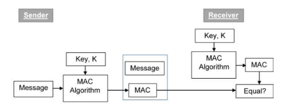
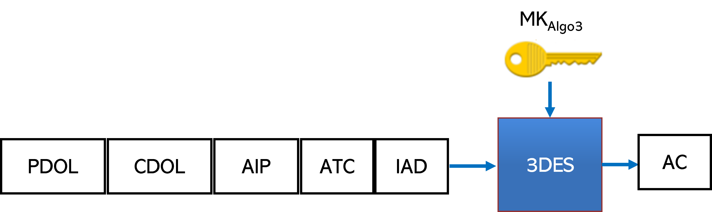
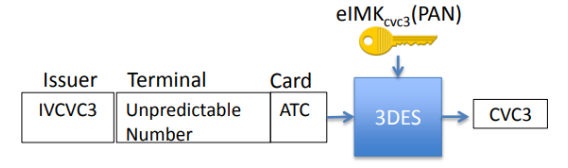

## What is Replay Attack?

As defined by [wikipedia](https://en.wikipedia.org/wiki/Replay_attack), a replay attack is a form of network attack in which valid data transmission is maliciously or fraudulently repeated or delayed. A simple replay attack that captures user password and reuse to login into the system can be illustrated as in the below picture:

Fig. 1: Replay Attack

In this scenario, assuming that Bob is a service provider, Alice is using her credential to login to Bob's service. After a couple of messages exchanged, Alice authenticates to Bob's service and Bob will grant/authorize an access to Alice in returns. Without proper prevention measures, Eve might be able to intercept those messages and then pretending as Alice, she tries to replay them to gain an unauthorized access to Bob's service. 

The impact of replay attacks could be from medium to very high to the system. If replaying allows the hacker to gain a single unauthorized access to a service system (and limited to the service provided), then the impact is just medium. However, if a replay attack allows the hacker to have an access to the system (temporary or permanent), and from that he is able to control or escalate to higher level of access by exploiting the system's vulnerabilities, then the impact is highly severe. 

Typically, replay attacks could be prevented by making a message/transaction unrepeateable. That could be done by assigning an unique random number to the message/transaction or a networking session. A service provider can check if the granted token was used or not before granting an access to the system. A network message/packet from previous session (distinguished from unique session ID) won't be accepted by the server, etc. 

Fig. 2: Message Authentication Code

The replay attack could be also prevented by using a Message Authentication Code (MAC) or a challenge-response authentication. More details of the countermeasures could be found in [Prevention and countermeasures, replay attack](https://en.wikipedia.org/wiki/Replay_attack).

## What is a Replay Attack on Payment schemes

Similarly to a replay attack in network security, in this context, a fraudster will try to replay a payment message (e.g., APDU or Application Protocol Data Unit in smart card transactions) captured from a victim payment card to withdraw money into his wallet/account. It can be illustrated as in the below picture:

Fig. 3: Replay attacks against Payment Systems

Diffrent from a replay attack in network security, 'transaction processor' in payment schemes is not a single server or program, it may consist of some entities, including merchant's POS terminal, acquiring bank, card network, issuing bank. The authentication and authorization processes involving more than one party are more complicated, and hence present more higher risks to replay attacks. 

This could be carried out in the following potential attack paths:

1. Hacker collects payment transactions from one payment network, and then replay reformatted transactions to another payment network;
2. Hacker collects payment authentication tokens (CVC3) from a victim card, that have not been settled yet, then replay them on another point-ofsale (POS) terminal.  
3. Hacker asks victim card for payment requests (ARQC or Application Request Cryptogram) at one POS terminal, then redeems those ARQCs at another POS terminal (or ATM).

## How EMV protocol is designed to prevent replay attacks?
Let's review the EMV transaction flow to see how it was designed to prevent replay attacks. The full EMV transaction flow is depicted as in the below diagram:

<!--

-->

Fig. 4: EMV Transaction Flow (Source: EMV Book 3 - Application Specification [1])

Briefly, a EMV payment consists of the following steps:

1. Application Selection
2. Card Data Authentication
3. Cardholder Verification
4. Terminal Action Analysis
5. Card Action Analysis
6. Application Cryptogram Generation
7. Script Processing
8. Completion

The full EMV transaction flow is complex, and explaining it in details was not an intention of this article. Let check what are countermeasures proposed in the EMV protocol to prevent a replay attack.

As shown in **Fig. 4**, in order to be authorized a (online) transaction, payment card must generate an *Application Request Cryptogram* (ARQC) that sent to the issuing bank to verify. An ARQC cryptogram contains an *Application Transaction Counter* (ATC) (that is securely protected and computed in payment smartcards), a MAC signature that signs on a dynamic data, including an *Unpredictable Number* (UN) generated by the POS Terminal. The MAC signature can be only generated by the card holding a Master secret key (MK) in a secure memory, and only verified by the issuer for its integrity and confidentiality. Furthermore, the issuer can verify the ATC for its *uniqueness* and *validity* (i.e., monotonically increasing). If any checks above fail, the transaction won't be authorized by the issuing bank. 

Fig. 5: Generation of Application Cryptogram

In order to support an older version of POS Terminals that only accept Magnetic Stripe payment cards, EMV cards enable a compatible mode, so-called MagStripe. In this mode, a dynamic card verification code (CVC3) will be generated instead of MAC signature for authorizing the transactions. This value is generated by applying a cryptographic checksum on the card’s ATC and UN (generated by terminal) with a dedicated symmetric key securely stored in the payment card. This CVC3 value and ATC will be sent to the issuing bank for verifying. Note that the authentication code CVC3 authenticates only the card and not the contents of a payment transaction. 

Fig. 6: Generation of CVC3 values

The main differences between EMV mode and MagStripe mode include: (1) no offline authentication of static card data; and (2) no authentication of payment transaction data (due to no contents of transactions).

In both mode, the application transaction counter (ATC) aims at preventing re-use of previously used authentication codes (re-play). The unpredictable number (UN) aims at preventing pre-generation of authentication codes on a real card for later use in fraudulent transactions (pre-play).

## References

[1] EMV 4.1 Book 3 [Application Specification](https://www.emvco.com/emv-technologies/emv-contact-chip/)

[2] Krebs on Security, ‘Replay’ Attacks Spoof Chip Card Charges, Oct 2014. 

[3] Bond, Choudary, Murdoch, Skorobogatov, and Anderson, Chip and skim: cloning EMV cards with the preplay attack, Computing Research Repository (CoRR), arXiv:1209.2531 [cs.CY], Sept. 2012.

[4] Michael Roland, and Josef Langer, Cloning Credit Cards: A combined pre-play and downgrade attack on EMV Contactless

[5] Salvador Mendoza, NFC Payments: The Art of Relay & Replay Attacks, July 2018 

[6] Kaspersky researchers, PRILEX: The pricey prickle Credit Card complex, Sep. 2022
